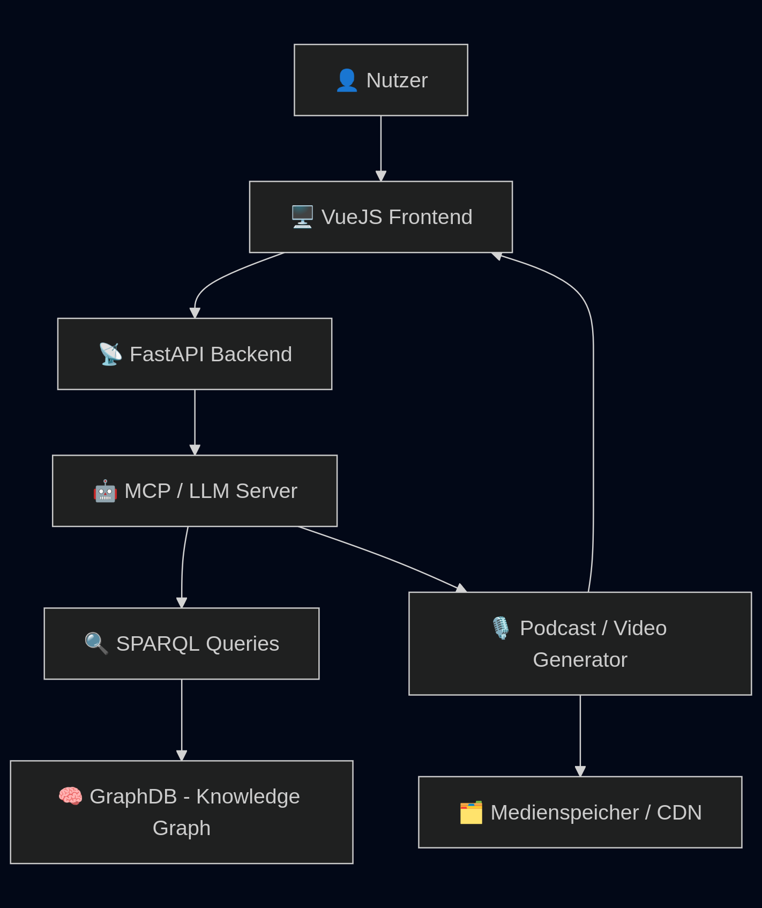

# FrogDisKonto - SpendCast

## Technische Informationen für die Jury

### Aktueller Stand des Sourcecodes
[Link zu Github Repository](https://github.com/CeVauDe/FrogDisKonto)

### Ausgangslage - Fokus
- Interaktive Kommunikation mit den eigenen Finanzen durch ein Chatbot-Interface
- Emotionale Aufbereitung von Finanzdaten mittels generativer Medien (Podcasts, Videos)
- Visualisierung persönlicher Finanzgewohnheiten auf spielerische Art
- Niedrigschwelliger Zugang zu komplexen Finanzinformationen durch KI und UX/UI-Optimierung

### Ausgangslage - Grundsatzentscheide
- Frontend in Vue 3 mit Vite für eine moderne, reaktive und performante UI-Entwicklung
- Backend in Python mit FastAPI für eine leichtgewichtige, asynchrone und skalierbare API
- Verwendung eines Graphdatenbank-Ansatzes (GraphDB + SPARQL) zur Modellierung und Analyse von Finanzwissen
- Einsatz von Generativer KI (LLMs + Audio-/Video-Generation) zur kreativen Darstellung von Nutzerfinanzen
- Nutzung von mehreren MCP Servern um dem LLM Zugriff auf die Finanz- und weiterführende Daten zu geben
- Starke UX-Fokussierung: z.B. automatische Scroll-Effekte, animierte Ladezustände, Splashscreens

### Technischer Aufbau
| Komponente   | Einsatzbereich                                     |
| ------------ | -------------------------------------------------- |
| **Vue 3 + Vite** | Frontend SPA mit schnellem Hot Reloading           |
| **FontAwesome** | Icons für UI-Komponenten                           |
| **Motion**   | Animationen, Interaktionen, Feeling                |
| **FastAPI**  | REST-API Backend                                   |
| **Python**   | Backend-Logik und Datenvorverarbeitung             |
| **GraphDB (RDF)** | Wissensmodellierung von Finanzdaten                |
| **SPARQL**   | Abfragen innerhalb der Wissensgraphen              |
| **MCP / AI-Server** | LLM-gesteuerte Datenanalyse und Medien-Generierung |
| **FFmpeg, TTS, etc.** | Video- & Audioerstellung aus generierten Texten    |

### Implementation
Spezielle Punkte zur Implementation:
- Automatisches Scrollverhalten im Chatverlauf für ein natürliches Gesprächsgefühl
- Tippen-Animation bei KI-Antworten zur Simulation eines echten Gegenübers
- Splashscreen / Startanimation zur Emotionalisierung des Einstiegs
- Streaming von AI-generierten Podcasts/Videos, direkt im Interface eingebettet
- SPARQL-Queries dynamisch aus AI-Antworten generiert (AI-assisted graph querying)

Technisch besonders cool:
- Finanzdaten in einem semantischen Graphenmodell abzulegen erlaubt kontextsensitives Reasoning
- Multimodale Ausgaben (Text, Audio, Video) machen komplexe Inhalte greifbar
- Einfache Architektur, aber sehr expressive UX durch Motion und Feeling

### Abgrenzung / Offene Punkte
❌ Keine Authentifizierung oder Sicherheitslogik: Fokus liegt aktuell auf Demo & Konzept
❌ Keine Live-Bankdaten-Anbindung – es wird mit vorbereiteten (aber realitätsnahen) Transaktionsdaten gearbeitet
❌ Kein Fine-Tuning der AI – stattdessen Prompt Engineering über Middleware
Fokus liegt auf Prototyping, User Experience & Storytelling. Sicherheit und Datenschutz erfordern gesonderte Betrachtung und Zeitbudget.
